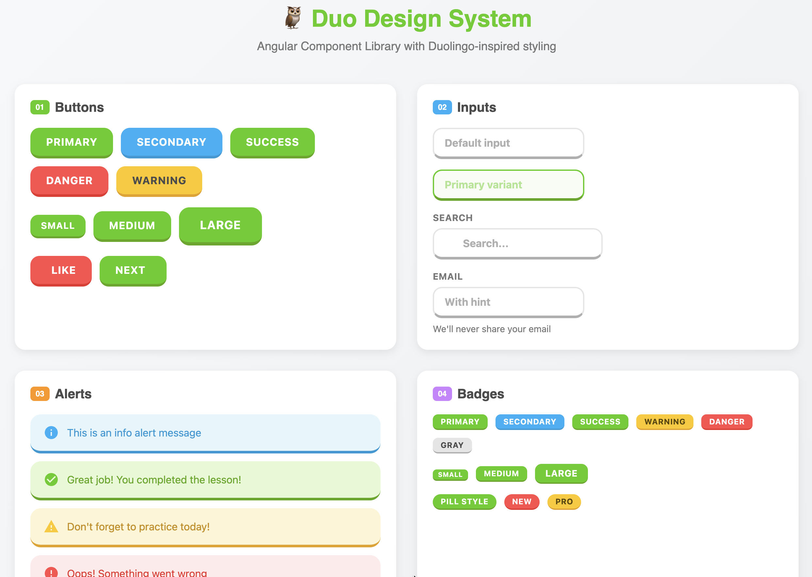

# Duo Design System



A Duolingo-inspired Angular component library with playful 3D effects and vibrant colors. Built with Angular 20 and standalone components.

## Components

| Component | Description |
|-----------|-------------|
| **Button** | 5 variants (primary, secondary, danger, success, warning), 3 sizes, icon support |
| **Input** | Form inputs with validation states, icons, labels, and hints |
| **Alert** | 4 variants (info, success, warning, danger) for notifications |
| **Badge** | 6 color variants with pill style support |
| **Loader** | 3 animation types (spinner, dots, pulse) |
| **Modal** | Dialog with backdrop and animations |
| **Radio** | Radio button groups with form integration |
| **Switch** | Toggle switches with multiple colors |

## Installation

```bash
npm install
```

## Storybook

Run Storybook to explore all components:

```bash
npm run storybook
```

Open [http://localhost:6006](http://localhost:6006) to view the component library.

---

This project was generated using [Angular CLI](https://github.com/angular/angular-cli) version 20.1.4.

## Development server

To start a local development server, run:

```bash
ng serve
```

Once the server is running, open your browser and navigate to `http://localhost:4200/`. The application will automatically reload whenever you modify any of the source files.

## Code scaffolding

Angular CLI includes powerful code scaffolding tools. To generate a new component, run:

```bash
ng generate component component-name
```

For a complete list of available schematics (such as `components`, `directives`, or `pipes`), run:

```bash
ng generate --help
```

## Building

To build the project run:

```bash
ng build
```

This will compile your project and store the build artifacts in the `dist/` directory. By default, the production build optimizes your application for performance and speed.

## Running unit tests

To execute unit tests with the [Karma](https://karma-runner.github.io) test runner, use the following command:

```bash
ng test
```

## Running end-to-end tests

For end-to-end (e2e) testing, run:

```bash
ng e2e
```

Angular CLI does not come with an end-to-end testing framework by default. You can choose one that suits your needs.

## Additional Resources

For more information on using the Angular CLI, including detailed command references, visit the [Angular CLI Overview and Command Reference](https://angular.dev/tools/cli) page.
